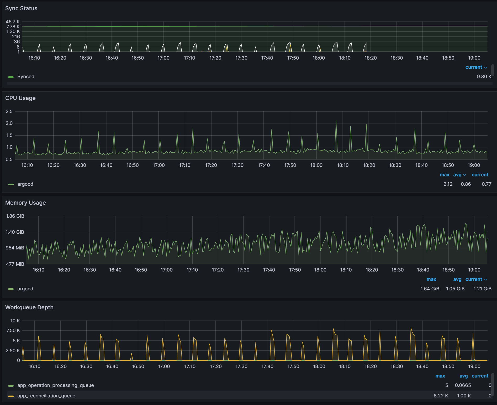
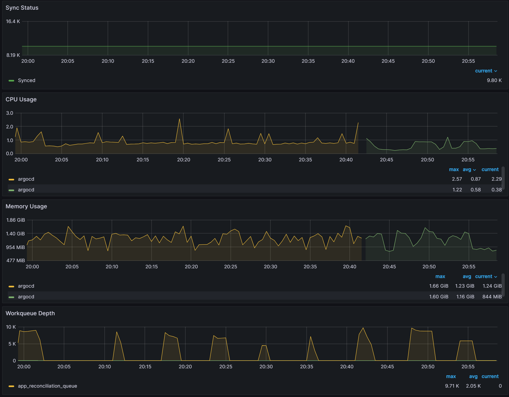
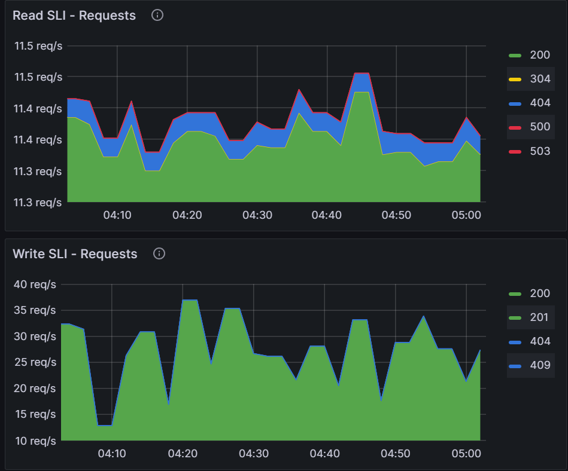

# ACK resources as Argo Apps

**Testing environment:**
* 100 EKS clusters
* Utilizing ACK IAM Controller
* 9800 Argo Apps with a single IAM user in each app

The ACK IAM Controller is setup to update ACK resources every 10 seconds changing the lastTransitionTime in the status field. This is not normal behavior as the default reconciliation time is 10 hours.

Below are the results with ArgoCD set to 3 min reconciliation period. You see avg CPU utilization at 0.86 while max CPU utilization was 2.12. Memory is consistent at 1.05 GB average.



Following the [ArgoCD documentation](https://argo-cd.readthedocs.io/en/stable/operator-manual/reconcile/) on ignoreUpdates we can tell ArgoCD to ignore the status field updates from being watched.

```
data:
  resource.ignoreResourceUpdatesEnabled: "true"
  resource.customizations.ignoreResourceUpdates.all: |
    jsonPointers:
    - /status
```

After making those changes, we can see avg CPU utilization dropped from 0.87 to 0.58. Peak CPU usage dropped from 2.57 to 1.22. Memory utilization was unaffected.



Another metric to watch is how the activity affects the K8s API Server. There is not a lot of activity in the reconciliation process unless there are syncing operations:



Reconcile loop or syncing loops would not occur with ACK as the controller only updates status fields. Which can be ignored in case they become too noisy.

Another observation that we made is around the ACK controller adding in default values into the manifest spec which are not specified by the original spec. An example of this is the following spec:

```
apiVersion: iam.services.k8s.aws/v1alpha1
kind: Role
metadata:
  name: testrole
spec:
  name: testrole
  description: ""
  assumeRolePolicyDocument: >
    {
      "Version":"2012-10-17",
      "Statement": [{
        "Effect":"Allow",
        "Principal": {
          "Service": [
            "ec2.amazonaws.com"
          ]
        },
        "Action": ["sts:AssumeRole"]
      }]
    }
  tags:
    - key: tag1
      value: val1
```

The ACK controller will add maxSessionDuration as it is not defined in the original spec. When it is deployed by ArgoCD the controller in the remote cluster will add it in:

```
  description: ''
  maxSessionDuration: 3600
  name: testrole
  path: /
  tags:
    - key: tag1
      value: val1
status:
  ackResourceMetadata:
    arn: 'arn:aws:iam::240127755072:role/testrole'
    ownerAccountID: '240127755072'
    region: us-east-1
```

This does not trigger a Out-of-Sync status as ArgoCD is only comparing the original fields with the deployed fields. It doesn’t track added fields. So this would not cause a reconcile/sync loop.