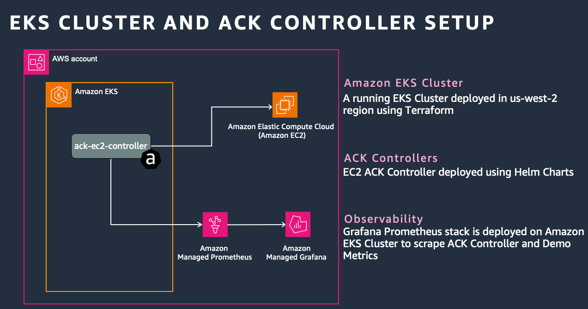
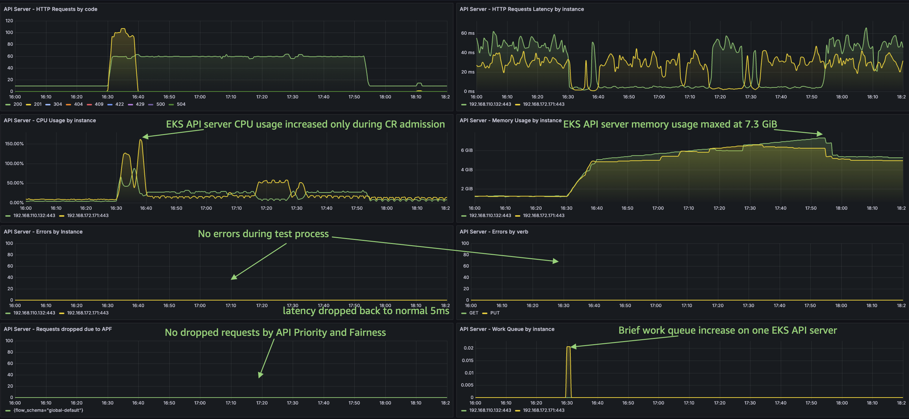

# EC2 ACK Controller Performance at Scale

**TL;DR:** This document presents a comprehensive analysis of the performance
and scalability of EC2 AWS Controller for Kubernetes(ACK) when deploying a large
number of resources. The key finding is that single EC2 ACK controller reconciled 49900 Security Group resources
in 86 minutes. Deploying an additional 90 Security Groups resources on top of the existing 49900 resources took only 2 minutes, demonstrating ACK's efficient reconciliation process.
During reconcilliation process there was no significant impact or errors on EKS API Servers.  

## Introduction

The purpose of the load test was to deploy 50k Security Groups and observe how EC2 ACK controller and EKS control plane will handle it. In addition, we wanted to measure the time it takes a controller to add new resources, once it is already handling 50k. We picked up EC2 ACK controller for a reason, each Security Group resource also contains 60 ingress/egress rules which make this CRDs prety heavy for etcd to handle.  

During reconcilliation process EC2 ACK Contoller made 300k AWS API calls: 
* 50k AuthorizeSecurityGroupIngress
* 50k AuthorizeSecurityGroupEgress
* 50k CreateSecurityGroup
* 50k DescribeSecurityGoups
* 100k DescribeSecurityGroupRules


**Testing environment:**

* EKS cluster (version: 1.31)
* ACK EC2 Controller (version: 1.2.27)
* Amazon Managed Prometheus + Amazon Managed Grafana Stack + [Prometheus Operator](https://github.com/prometheus-operator/kube-prometheus)
* [Custom Grafana Dashboard](/casestudies/ec2-ack-load-testing/ACK%20Performance%20at%20Scale.json) 
* Instance types: m5.xlarge (x1 node, x86 architecture)



Prometheus is configured to scrape ACK Controller metrics and EKS control plane metrics, which will help us analyze the
performance and other metrics like resource counts, reconciliation time, etc.

**Applying ACK Custom Resource Definitions**

During testing we found that Helm templating engine struggled to render 50k Security Group CRD's and fill them with Security Group rules, so we had to write custom GO script.

## Key Observations

### ACK Controller default settings

Default configuration of the EC2 ACK Controller via Helm Chart configures the deployment's CPU and Memory resource limits to 100m and 128Mi, respectively.  

`defaultMaxConcurrentSyncs` is an ACK Controller's parameter that can be set in the Controller's Helm Chart
values file during installation. It represents the default number of concurrent syncs that the ACK reconciler
can perform. By default, the value of `defaultMaxConcurrentSyncs` is 1.  Based on number of resources we provision in this test and previous experience, we have set 
this value to 200.  

On deploying 50K resources, EC2 ACK Controller pod got CRASHED with OOM (Out of Memory) Killed error, so we had to adjust default settings. You can do this using following commands and values will depend on number of resources to be managed and number of concurrent syncs. 
```
export SERVICE=ec2
export RELEASE_VERSION=$(curl -sL https://api.github.com/repos/aws-controllers-k8s/${SERVICE}-controller/releases/latest \
| jq -r '.tag_name | ltrimstr("v")')
export ACK_SYSTEM_NAMESPACE=ack-system
export AWS_REGION=us-west-2

aws ecr-public get-login-password --region us-east-1 | helm registry login --username AWS --password-stdin public.ecr.aws
helm upgrade -i --create-namespace -n $ACK_SYSTEM_NAMESPACE ack-$SERVICE-controller \
  oci://public.ecr.aws/aws-controllers-k8s/$SERVICE-chart --version=$RELEASE_VERSION \
  --set=aws.region=$AWS_REGION --set=metrics.service.create=true set=reconcile.defaultMaxConcurrentSyncs=200 \
  --set=resources.limits.memory=4Gi --set=resources.limits.cpu=1000m
```

### AWS API Throttling

Depending on number/type of provisioned resources, number of concurrent syncs and limits in your particular AWS account you might experience AWS API Throttling.
AWS ACK Controllers have in-built rety and exponential backoff logic so this won't be critical, but may delay reconcilliation process. You can experiment with concurrent sync numbers and/or work with AWS suppport to increase rate limits for particular services. 

### Analyzing provisioning and reconcilliation process

When we submitted initial 49900 CRDs, they were processed by EKS API server in 9 minutes and it took 87 minutes in total for EC2 ACK Controller to reconcile all resources
with AWS APIs. EC2 ACK controller CPU utilization remained minimal through the process and memory usage maxed out at 2.25 GiB. There was increase on etcd request latency for the duration of the process, but it remained within normal range.   


EKS API server CPU utilization increaed only in the first 9 minuts when CRDs were applied and memory usage maxed out at 7.3 GiB. There was not API server errors registered during the process and not requests were dropped by APF.  



### Analyzing Reconciliation Time While Creating New Additional Resources

The final analysis was to test how much time the ACK Controllers would take to deploy 90 additional Security Groups on top of the
already existing. It took just under **2 minutes** to deploy 90 additional resources. 

## Troubleshooting

Here are some troubleshooting steps you can take if you encounter issues while deploying a
large number of resources with ACK:

1. **Increase CPU and Memory Limits**: If your controller pods are getting OOM Killed errors,
try increasing the CPU and Memory limits for the ACK controllers. In our case, increasing the
limits to 500m CPU and 1Gi Memory resolved the issue.

2. **Increase defaultMaxConcurrentSyncs**: If the deployment time for a large number of resources
is taking too long, try increasing the `defaultMaxConcurrentSyncs` parameter. This parameter controls
the number of concurrent syncs that the ACK reconciler can perform. In our case, increasing this
value from the default 1 to 200 significantly reduced the deployment time from over 2 hours to just 52 minutes.

3. **Watch for AWS API Throttling**: Depending on number/type of provisioned resources, number of concurrent
syncs and limits in your particular AWS account you might experience AWS API Throttling.
AWS ACK Controllers have in-built rety and exponential backoff logic so this won't be critical, but may delay reconcilliation process. You can experiment with concurrent sync numbers and/or work with AWS suppport to increase rate limits for particular services.

4. **Monitor Resource Usage**: Use tools like Prometheus and Grafana to monitor the resource
usage of your ACK controllers. This will help you identify any potential bottlenecks and
adjust the resource limits accordingly.

5. **Optimize Resource Deployment**: If you're deploying a large number of resources, consider
breaking them down into smaller batches or using techniques like batching or parallelization
to optimize the deployment process.

Remember, the optimal configuration may vary depending on your specific use case, cluster setup,
and resource requirements. It's always a good practice to monitor and adjust the settings based
on your observations and performance requirements.


