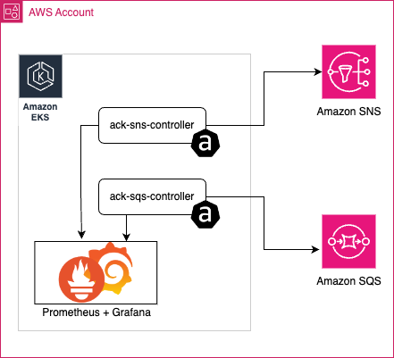
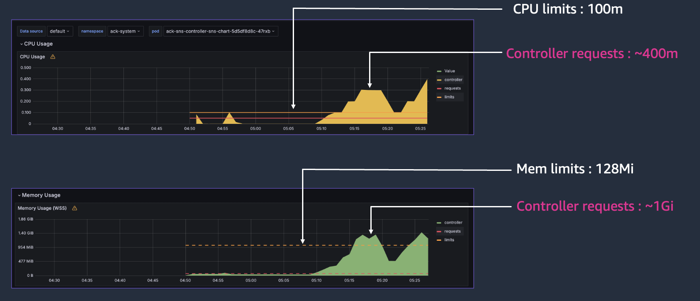
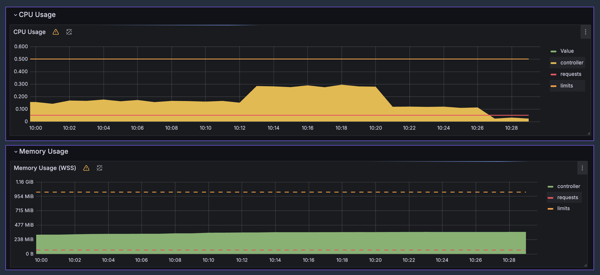
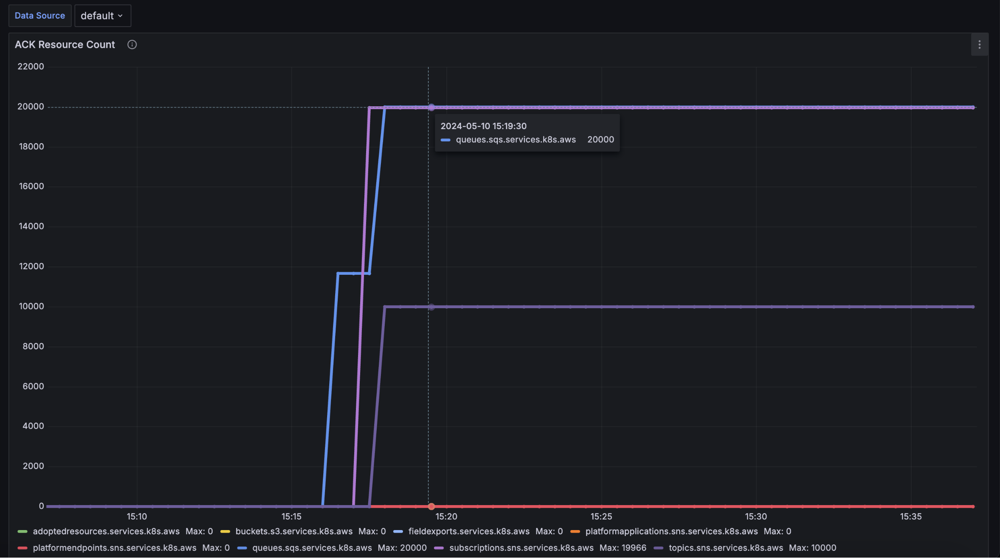
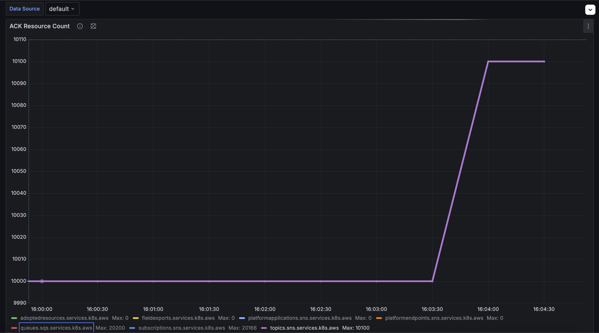

# Analyzing ACK Performance and Scalability

**TL;DR:** This document presents a comprehensive analysis of the performance and scalability of AWS Controllers for Kubernetes (ACK) when deploying a large number of resources. The key finding is that despite initially taking over 2 hours to deploy 50K resources, increasing the `defaultMaxConcurrentSyncs` parameter reduced the deployment time to just 52 minutes. More importantly, deploying an additional 500 resources on top of the existing 50K resources took only 30 seconds, demonstrating ACK's efficient reconciliation process.

## Introduction

This document presents a comprehensive analysis of the performance and scalability of AWS Controllers for Kubernetes (ACK) when deploying a large number of resources. The purpose of this study is to examine how ACK controllers handle the creation and management of 50K resources, including SNS topics and SQS queues.


**Testing environment:**

* EKS cluster (version: 1.29)
* ACK SNS Controller (version: 1.0.11)
* ACK SQS Controller (version: 1.0.13)
* Prometheus + Grafana Stack
* Instance types: m5.xlarge (x1 node, x86 architecture)



Prometheus is configured to scrape ACK Controller metrics which will help us analyze the performance and other metrics like resource counts, reconciliation time, etc. The 50K resources would be deployed using a Helm Chart.

**Deploying Helm Chart to provision AWS resources:**

The helm chart to provision 50K resources is placed under `helm` folder. The following command deploys 50K resources which includes 10K SNS Topics, 20K SQS Queues and 20K SNS Subscriptions. 
```
helm install ack-pub-sub-deploy helm/ --values ./helm/values.yaml --set pubSubsCount=10000
```

## Observations

### Test 1: Default Values, CPU 100m and Memory 128Mi

The default installation of SQS and SNS ACK Controllers via Helm Chart configures the deployment's CPU and Memory resource limits to 100m and 128Mi, respectively. On deploying 50K resources, both SQS and SNS Controller pods got CRASHED with OOM (Out of Memory) Killed error.



On analyzing the pods' runtime CPU and Memory resources in Grafana, the controller's runtime CPU requests were more than the default controller's CPU Limits (100m), whereas the controllers' memory requests were approximately 400m of CPU and 1Gi, respectively, but the controller's default memory limit was configured to be 128Mi.

### Test 2: CPU 500m and Memory 1Gi

We then upgraded ACK Controllers' CPU and memory resource limits to 500m and 1Gi, respectively.

```
export SERVICE=sqs
export RELEASE_VERSION=$(curl -sL https://api.github.com/repos/aws-controllers-k8s/${SERVICE}-controller/releases/latest | jq -r '.tag_name | ltrimstr("v")')
export ACK_SYSTEM_NAMESPACE=ack-system
export AWS_REGION=eu-west-1

aws ecr-public get-login-password --region us-east-1 | helm registry login --username AWS --password-stdin public.ecr.aws
helm upgrade -i --create-namespace -n $ACK_SYSTEM_NAMESPACE ack-$SERVICE-controller \
  oci://public.ecr.aws/aws-controllers-k8s/$SERVICE-chart --version=$RELEASE_VERSION --set=aws.region=$AWS_REGION --set=metrics.service.create=true --set=resources.limits.memory=1Gi --set=resources.limits.cpu=500m
```
### Upgraded Resource Limits

We did helm install again to deploy 50K resources, and now the controllers' requests were well within the limits, and there were no visible crashes on the controllers' pods.



### Analyzing Time Taken to Deploy 50K Resources

Now, we were able to deploy 50K resources using the Helm chart with upgraded ACK Controllers' resource limits. It took 2 hours and 15 minutes to deploy and provision 50K resources. That's quite a significant amount of time.



## Test 3: Increasing defaultMaxConcurrentSyncs

`defaultMaxConcurrentSyncs` is an ACK Controller's parameter that can be set in the Controller's Helm Chart values file during installation. It represents the default number of concurrent syncs that the ACK reconciler can perform. By default, the value of `defaultMaxConcurrentSyncs` is 1.

We then set `defaultMaxConcurrentSyncs` to 200 and tried deploying 50K resources at a time to analyze the time it takes now for provisioning.

```
export SERVICE=sqs
export RELEASE_VERSION=$(curl -sL https://api.github.com/repos/aws-controllers-k8s/${SERVICE}-controller/releases/latest | jq -r '.tag_name | ltrimstr("v")')
export ACK_SYSTEM_NAMESPACE=ack-system
export AWS_REGION=eu-west-1

aws ecr-public get-login-password --region us-east-1 | helm registry login --username AWS --password-stdin public.ecr.aws
helm upgrade -i --create-namespace -n $ACK_SYSTEM_NAMESPACE ack-$SERVICE-controller \
  oci://public.ecr.aws/aws-controllers-k8s/$SERVICE-chart --version=$RELEASE_VERSION --set=aws.region=$AWS_REGION --set=metrics.service.create=true set=reconcile.defaultMaxConcurrentSyncs=200 --set=resources.limits.memory=1Gi --set=resources.limits.cpu=500m
```
Guess what, now it just took 52 minutes to deploy 50K resources.


### Analyzing Reconciliation Time While Creating New Additional Resources

The final analysis was to test how much time the ACK Controllers would take to deploy 500 additional resources, including 100 SNS Topics, 200 SQS Queues, and 200 SNS Subscriptions, on top of the already existing 50K resources. This would help us examine how ACK deals with reconciliation.

So we installed another Helm chart which would deploy 500 additional resources.



> ### ⚡ Guess what, it just took **30 seconds** to deploy 500 additional resources, and hence the reconciliation time is negligible. ⚡

## Troubleshooting

Here are some troubleshooting steps you can take if you encounter issues while deploying a large number of resources with ACK:

1. **Increase CPU and Memory Limits**: If your controller pods are getting OOM Killed errors, try increasing the CPU and Memory limits for the ACK controllers. In our case, increasing the limits to 500m CPU and 1Gi Memory resolved the issue.

2. **Increase defaultMaxConcurrentSyncs**: If the deployment time for a large number of resources is taking too long, try increasing the `defaultMaxConcurrentSyncs` parameter. This parameter controls the number of concurrent syncs that the ACK reconciler can perform. In our case, increasing this value from the default 1 to 200 significantly reduced the deployment time from over 2 hours to just 52 minutes.

3. **Monitor Resource Usage**: Use tools like Prometheus and Grafana to monitor the resource usage of your ACK controllers. This will help you identify any potential bottlenecks and adjust the resource limits accordingly.

4. **Optimize Resource Deployment**: If you're deploying a large number of resources, consider breaking them down into smaller batches or using techniques like batching or parallelization to optimize the deployment process.

Remember, the optimal configuration may vary depending on your specific use case, cluster setup, and resource requirements. It's always a good practice to monitor and adjust the settings based on your observations and performance requirements.


