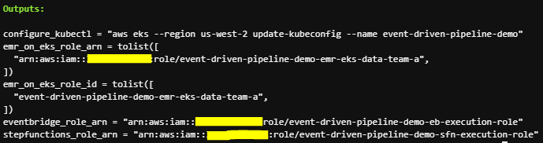
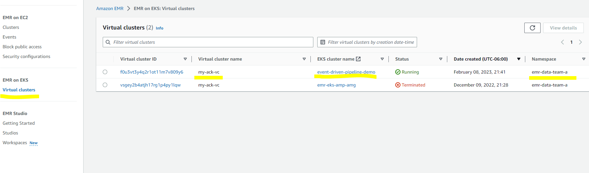
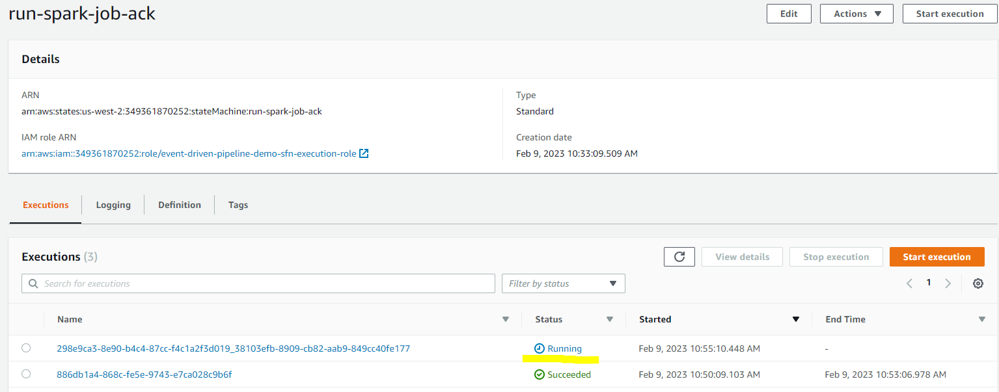
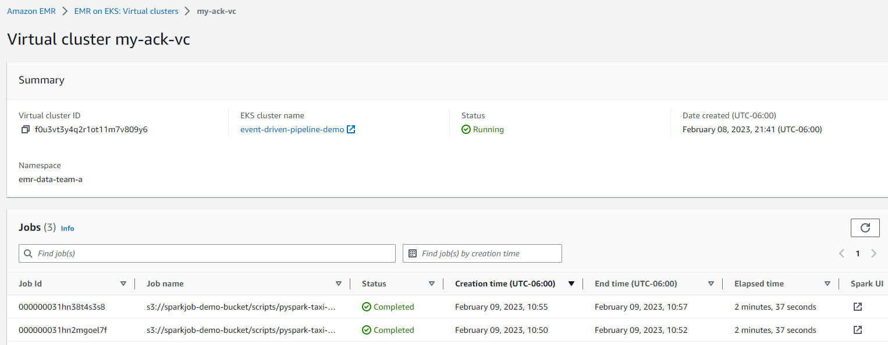

# Build Event-Driven Data Pipelines using AWS Controllers for Kubernetes (ACK) and Amazon EMR on EKS
In this example, we demonstrate to build an event-driven data pipeline using [AWS Controllers for Kubernetes (ACK)](https://aws-controllers-k8s.github.io/community/docs/community/overview/) and Amazon EMR on EKS. ACK is used to provision and configure serverless AWS resources: [Amazon EventBridge](https://aws.amazon.com/eventbridge/) and [AWS Step Functions](https://aws.amazon.com/step-functions/). Triggered by an Amazon EventBridge rule, AWS Step Functions orchestrates jobs running in Amazon EMR on EKS. By using ACK, you can use the Kubernetes API and configuration language to create and configure AWS resources the same way you create and configure a Kubernetes data processing jobs. The team can do the whole data operation without leaving the Kubernetes platform and only need to maintain the EKS cluster since all the other components are serverless.


The example demonstrates to build an event-driven data pipeline using ACK and Amazon EMR on EKS. Triggered by an Amazon EventBridge rule, AWS Step Functions orchestrates jobs running in Amazon EMR on EKS. 

## Prerequisites:

Ensure that you have the following tools installed locally:

1. [aws cli](https://docs.aws.amazon.com/cli/latest/userguide/install-cliv2.html)
2. [kubectl](https://Kubernetes.io/docs/tasks/tools/)
3. [terraform](https://learn.hashicorp.com/tutorials/terraform/install-cli)

## Deploy

To provision this example:

```bash
git clone https://github.com/aws-controllers-k8s/examples.git
cd usecases/event-driven-pipeline

region=<your region> # set region variable for following commands
terraform init
terraform apply -var region=$region #defaults to us-west-2
```

Enter `yes` at command prompt to apply

The following components are provisioned in your environment:
- A sample VPC, 3 Private Subnets and 3 Public Subnets
- Internet gateway for Public Subnets and NAT Gateway for Private Subnets
- EKS Cluster Control plane with one managed node group
- EKS Managed Add-ons: VPC_CNI, CoreDNS, Kube_Proxy, EBS_CSI_Driver
- K8S cluster autoscaler and fluentbit agent
- IAM execution roles for EMR on EKS, Step Functions and EventBridge 



### Validate

The following command will update the `kubeconfig` on your local machine and allow you to interact with your EKS Cluster using `kubectl` to validate the deployment.

### Run `update-kubeconfig` command:

```bash
aws eks --region us-west-2 update-kubeconfig --name event-driven-pipeline-demo
```

### List the nodes

```bash
kubectl get nodes

# Output should look like below
NAME                                        STATUS   ROLES    AGE     VERSION
ip-10-1-10-64.us-west-2.compute.internal    Ready    <none>   19h     v1.24.9-eks-49d8fe8
ip-10-1-10-65.us-west-2.compute.internal    Ready    <none>   19h     v1.24.9-eks-49d8fe8
ip-10-1-10-7.us-west-2.compute.internal     Ready    <none>   19h     v1.24.9-eks-49d8fe8
ip-10-1-10-73.us-west-2.compute.internal    Ready    <none>   19h     v1.24.9-eks-49d8fe8
ip-10-1-11-96.us-west-2.compute.internal    Ready    <none>   19h     v1.24.9-eks-49d8fe8
ip-10-1-12-197.us-west-2.compute.internal   Ready    <none>   19h     v1.24.9-eks-49d8fe8
```

## Set up the event-driven pipeline
### Create an EMR virtual cluster
Let’s start by creating a [virtual cluster](https://docs.aws.amazon.com/emr/latest/EMR-on-EKS-DevelopmentGuide/virtual-cluster.html) in EMR and link it with a Kubernetes namespace in EKS. By doing that, the virtual cluster will use the linked namespace in EKS for hosting spark workloads.

Let's apply the manifest by using kubectl command below. Once done, you can go to *EMR console*, click *Virtual clusters* and you should see the cluster record as shown below.  
```bash
kubectl apply -f ack-yamls/emr-virtualcluster.yaml
```



### Create a S3 bucket and upload data
Next, let’s create a S3 bucket for storing spark pod templates and sample data. 
```bash
kubectl apply -f ack-yamls/s3.yaml
```
*Note*: If you don’t see the bucket got created, you can check the log from ACK S3 controller pod for details. The error is mostly caused by the bucket with the same name has existed. You need to change the bucket name in s3.yaml as well as in eventbridge.yaml and sfn.yaml. You also need to update upload-inputdata.sh and upload-spark-scripts.sh with the new bucket name.

Run the command below to upload input data and pod templates. Once done, sparkjob-demo-bucket S3 bucket is created with two folders: input and scripts.
```bash
bash spark-scripts-data/upload-inputdata.sh
```

### Create a Step Functions state machine

You need to make the following changes in sfn.yaml before apply. 

* replace the value for roleARN with stepfunctions_role_arn 
* replace the value for ExecutionRoleArn with emr_on_eks_role_arn
* replace the value for VirtualClusterId with your virtual cluster id
* optional: change sparkjob-demo-bucket with your bucket name 

sfn.yaml
```bash
apiVersion: sfn.services.k8s.aws/v1alpha1
kind: StateMachine
metadata:
  name: run-spark-job-ack
spec:
  name: run-spark-job-ack
  roleARN: "arn:aws:iam::xxxxxxxxxxx:role/event-driven-pipeline-demo-sfn-execution-role"   # replace with your stepfunctions_role_arn
  tags:
  - key: owner
    value: sfn-ack
  definition: |
      {
      "Comment": "A description of my state machine",
      "StartAt": "input-output-s3",
      "States": {
        "input-output-s3": {
          "Type": "Task",
          "Resource": "arn:aws:states:::emr-containers:startJobRun.sync",
          "Parameters": {
            "VirtualClusterId": "f0u3vt3y4q2r1ot11m7v809y6",  
            "ExecutionRoleArn": "arn:aws:iam::xxxxxxxxxxx:role/event-driven-pipeline-demo-emr-eks-data-team-a",
            "ReleaseLabel": "emr-6.7.0-latest",
            "JobDriver": {
              "SparkSubmitJobDriver": {
                "EntryPoint": "s3://sparkjob-demo-bucket/scripts/pyspark-taxi-trip.py",
                "EntryPointArguments": [
                  "s3://sparkjob-demo-bucket/input/",
                  "s3://sparkjob-demo-bucket/output/"
                ],
                "SparkSubmitParameters": "--conf spark.executor.instances=10"
              }
            },
            "ConfigurationOverrides": {
              "ApplicationConfiguration": [
                {
                 "Classification": "spark-defaults",
                "Properties": {
                  "spark.driver.cores":"1",
                  "spark.executor.cores":"1",
                  "spark.driver.memory": "10g",
                  "spark.executor.memory": "10g",
                  "spark.kubernetes.driver.podTemplateFile":"s3://sparkjob-demo-bucket/scripts/driver-pod-template.yaml",
                  "spark.kubernetes.executor.podTemplateFile":"s3://sparkjob-demo-bucket/scripts/executor-pod-template.yaml",
                  "spark.local.dir" : "/data1,/data2"
                }
              }
              ]
            }...
```
You can get your virtual cluster id from EMR console or use the command below.
```bash
kubectl get virtualcluster -o jsonpath={.items..status.id}
# result:
f0u3vt3y4q2r1ot11m7v809y6  # VirtualClusterId
```
Then, apply the manifest to create the Step Functions state machine.
```bash
kubectl apply -f ack-yamls/sfn.yaml
```

### Create an EventBridge rule
The last step is to create an EventBridge rule which is used as an event broker to receive event notifications from S3. Whenever a new file, such as a new spark script, is created in the S3 bucket, the EventBridge rule will evaluate (filter) the event and invoke the Step Functions if it matches the specified rule pattern, triggering the configured spark job.

```bash
kubectl get StateMachine -o jsonpath={.items..status.ackResourceMetadata.arn}
# result
arn: arn:aws:states:us-west-2:xxxxxxxxxx:stateMachine:run-spark-job-ack # sfn_arn
```
Then, update eventbridge.yaml with 

* replace the value for roleARN with eventbridge_role_arn
* replace with arn with your sfn_arn 
* optional: change sparkjob-demo-bucket with your bucket name 
eventbridge.yaml
```bash
apiVersion: eventbridge.services.k8s.aws/v1alpha1
kind: Rule
metadata:
  name: eb-rule-ack
spec:
  name: eb-rule-ack
  description: "ACK EventBridge Filter Rule to sfn using event bus reference"
  eventPattern: | 
    {
      "source": ["aws.s3"],
      "detail-type": ["Object Created"],
      "detail": {
        "bucket": {
          "name": ["sparkjob-demo-bucket"]    
        },
        "object": {
          "key": [{
            "prefix": "scripts/"
          }]
        }
      }
    }
  targets:
    - arn: arn:aws:states:us-west-2:xxxxxxxxxx:stateMachine:run-spark-job-ack # replace with your sfn arn
      id: sfn-run-spark-job-target
      roleARN: arn:aws:iam::xxxxxxxxx:role/event-driven-pipeline-demo-eb-execution-role # replace your eventbridge_role_arn
      retryPolicy:
        maximumRetryAttempts: 0 # no retries
  tags:
    - key: owner
      value: eb-ack
```

By applying the EventBridge configuration file above, an EventBridge rule is created to monitor the folder scripts in S3 buckets sparkjob-demo-bucket. For demo simplicity, the dead-letter queue is not set and maximum retry attempts is set to 0. For production usage, please set them based on your requirements by following the [guidance](https://docs.aws.amazon.com/eventbridge/latest/userguide/eb-rule-dlq.html). 
```bash
kubectl apply -f ack-yamls/eventbridge.yaml
```

## Test the data pipeline
To test the data pipeline, we will trigger it by uploading a spark script to the S3 bucket scripts folder using the command below.
```bash
bash spark-scripts-data/upload-spark-scripts.sh
```
The upload event triggers the EventBridge event and then calls the Step Functions state machine. As shown below, you can go to *Step Functions* console, click *State machines* and choose *run-spark-job-ack*. You will see a new execution is running. 




For the spark job details, you can go to *EMR console,* choose *Virtual clusters* and then click *my-ack-vc*. You will get all the job running history for this virtual cluster. Click *Spark UI* button in any row, you will be redirected the spark history server for more spark driver and executor logs.




## Destroy

To teardown and remove the resources created in this example:

```bash
aws s3 rm s3://sparkjob-demo-bucket --recursive # clean up data in S3

kubectl delete -f ack-yamls/. #Delete aws resources created by ACK

terraform destroy -target="module.eks_blueprints_kubernetes_addons" -target="module.eks_ack_addons" -auto-approve -var region=$region
terraform destroy -target="module.eks_blueprints" -auto-approve -var region=$region
terraform destroy -auto-approve -var region=$region
```

<!-- BEGINNING OF PRE-COMMIT-TERRAFORM DOCS HOOK -->
## Requirements

| Name | Version |
|------|---------|
| <a name="requirement_terraform"></a> [terraform](#requirement\_terraform) | >= 1.0.0 |
| <a name="requirement_aws"></a> [aws](#requirement\_aws) | >= 3.72 |
| <a name="requirement_helm"></a> [helm](#requirement\_helm) | >= 2.4.1 |
| <a name="requirement_kubernetes"></a> [kubernetes](#requirement\_kubernetes) | >= 2.10 |

## Providers

| Name | Version |
|------|---------|
| <a name="provider_aws"></a> [aws](#provider\_aws) | >= 3.72 |
| <a name="provider_aws.ecr"></a> [aws.ecr](#provider\_aws.ecr) | >= 3.72 |

## Modules

| Name | Source | Version |
|------|--------|---------|
| <a name="module_eks_ack_addons"></a> [eks\_ack\_addons](#module\_eks\_ack\_addons) | ../../ | n/a |
| <a name="module_eks_blueprints"></a> [eks\_blueprints](#module\_eks\_blueprints) | github.com/aws-ia/terraform-aws-eks-blueprints | v4.18.1 |
| <a name="module_eks_blueprints_kubernetes_addons"></a> [eks\_blueprints\_kubernetes\_addons](#module\_eks\_blueprints\_kubernetes\_addons) | github.com/aws-ia/terraform-aws-eks-blueprints//modules/kubernetes-addons | v4.18.1 |
| <a name="module_vpc"></a> [vpc](#module\_vpc) | terraform-aws-modules/vpc/aws | ~> 3.0 |
| <a name="module_vpc_endpoints"></a> [vpc\_endpoints](#module\_vpc\_endpoints) | terraform-aws-modules/vpc/aws//modules/vpc-endpoints | ~> 3.0 |
| <a name="module_vpc_endpoints_sg"></a> [vpc\_endpoints\_sg](#module\_vpc\_endpoints\_sg) | terraform-aws-modules/security-group/aws | ~> 4.0 |

## Resources

| Name | Type |
|------|------|
| [aws_iam_policy.emr_on_eks](https://registry.terraform.io/providers/hashicorp/aws/latest/docs/resources/iam_policy) | resource |
| [aws_iam_role.eb_execution_role](https://registry.terraform.io/providers/hashicorp/aws/latest/docs/resources/iam_role) | resource |
| [aws_iam_role.sfn_execution_role](https://registry.terraform.io/providers/hashicorp/aws/latest/docs/resources/iam_role) | resource |
| [aws_availability_zones.available](https://registry.terraform.io/providers/hashicorp/aws/latest/docs/data-sources/availability_zones) | data source |
| [aws_caller_identity.current](https://registry.terraform.io/providers/hashicorp/aws/latest/docs/data-sources/caller_identity) | data source |
| [aws_ecrpublic_authorization_token.token](https://registry.terraform.io/providers/hashicorp/aws/latest/docs/data-sources/ecrpublic_authorization_token) | data source |
| [aws_eks_cluster_auth.this](https://registry.terraform.io/providers/hashicorp/aws/latest/docs/data-sources/eks_cluster_auth) | data source |
| [aws_iam_policy_document.emr_on_eks](https://registry.terraform.io/providers/hashicorp/aws/latest/docs/data-sources/iam_policy_document) | data source |
| [aws_partition.current](https://registry.terraform.io/providers/hashicorp/aws/latest/docs/data-sources/partition) | data source |
| [aws_region.current](https://registry.terraform.io/providers/hashicorp/aws/latest/docs/data-sources/region) | data source |

## Inputs

| Name | Description | Type | Default | Required |
|------|-------------|------|---------|:--------:|
| <a name="input_eks_cluster_version"></a> [eks\_cluster\_version](#input\_eks\_cluster\_version) | EKS Cluster version | `string` | `"1.24"` | no |
| <a name="input_name"></a> [name](#input\_name) | Name of the VPC and EKS Cluster | `string` | `"event-driven-pipeline-demo"` | no |
| <a name="input_region"></a> [region](#input\_region) | region | `string` | `"us-west-2"` | no |
| <a name="input_tags"></a> [tags](#input\_tags) | Default tags | `map(string)` | `{}` | no |
| <a name="input_vpc_cidr"></a> [vpc\_cidr](#input\_vpc\_cidr) | VPC CIDR | `string` | `"10.1.0.0/16"` | no |

## Outputs

| Name | Description |
|------|-------------|
| <a name="output_configure_kubectl"></a> [configure\_kubectl](#output\_configure\_kubectl) | Configure kubectl: make sure you're logged in with the correct AWS profile and run the following command to update your kubeconfig |
| <a name="output_emr_on_eks_role_arn"></a> [emr\_on\_eks\_role\_arn](#output\_emr\_on\_eks\_role\_arn) | IAM execution role arn for EMR on EKS |
| <a name="output_emr_on_eks_role_id"></a> [emr\_on\_eks\_role\_id](#output\_emr\_on\_eks\_role\_id) | IAM execution role ID for EMR on EKS |
| <a name="output_eventbridge_role_arn"></a> [eventbridge\_role\_arn](#output\_eventbridge\_role\_arn) | IAM execution role arn for eventbridge |
| <a name="output_stepfunctions_role_arn"></a> [stepfunctions\_role\_arn](#output\_stepfunctions\_role\_arn) | IAM execution role arn for step functions |
<!-- END OF PRE-COMMIT-TERRAFORM DOCS HOOK -->
